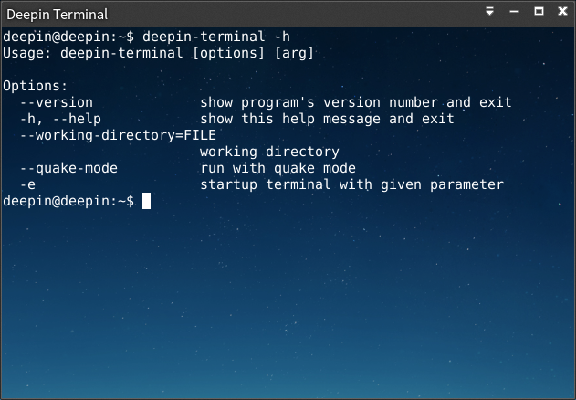
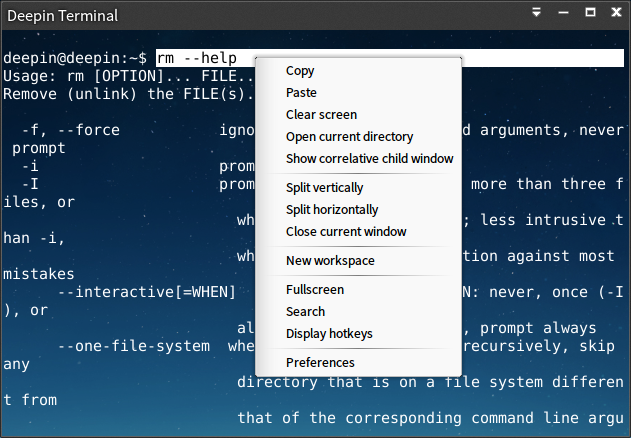
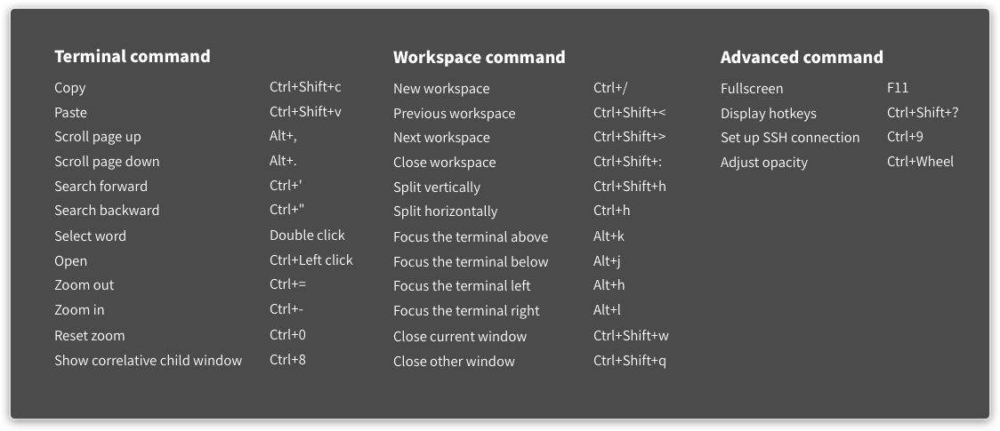
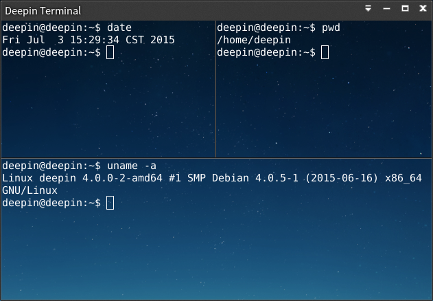
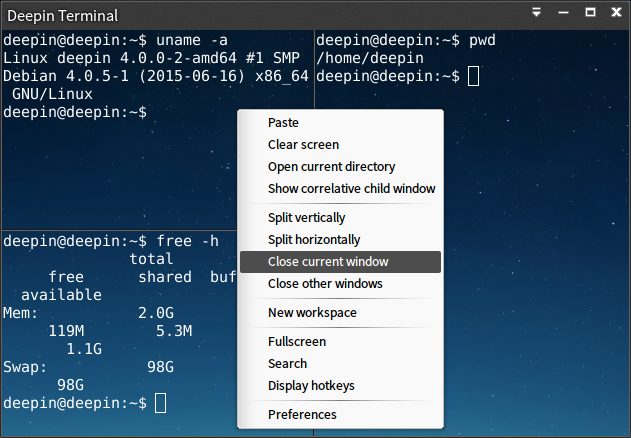
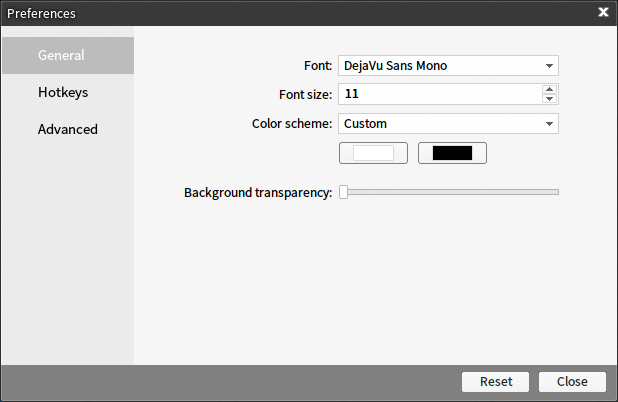
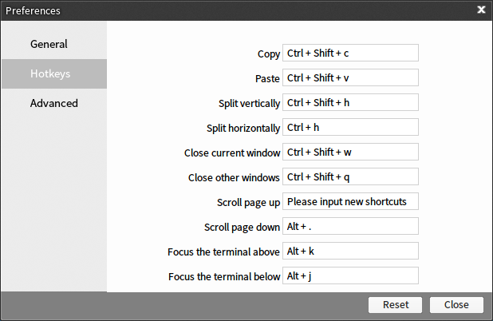
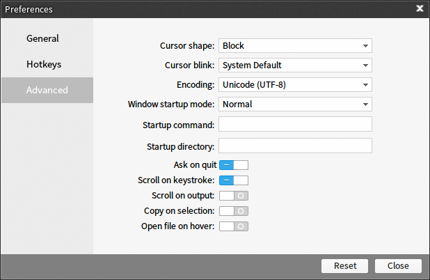

# Deepin Terminal|../common/deepin-terminal.svg|
## Overview|../common/icon_overview.svg|

Deepin Terminal can freely split window according to user requirements with horizontal and vertical screen split supported. It allows users to make terminal settings, including fonts and colors changing, background pictures customization, transparency adjustment and so on. You can input various operation commands in the terminal window by keyboard.

 

## Guide|../common/icon_guide.svg|

### Run Deepin Terminal ###

You can run Deepin Terminal by executing one of the following operations:

- Click on  on dock to enter launcher interface. Then find  to click on by skimming.

- Press ++ to open the terminal interface.

### Minimize Deepin Terminal ###

1. Open Deepin Terminal in launcher interface.

2. Click on  on Deepin Terminal interface to minimize to Dock.

3. If you want to restore normal display, click on  on Dock.

### Maximize Deepin Terminal ###

1. Open Deepin Terminal in launcher interface.

2. Click on  on Deepin Terminal interface to maximize Deepin Terminal window.

3. If you want to restore normal display, click on  on Dock.

### Close Deepin Terminal ###

#### Click the "Close" button to exit Deepin Terminal ####

1. Open Deepin Terminal in launcher interface.

2. On Deepin Terminal interface, click on  to exit Deepin Terminal.

#### Exit Deepin Terminal from Dock ####

1. Open Deepin Terminal in launcher interface.

2. Right click on  on Dock.

3. Click on **Close All**.

#### Exit Deepin Terminal from Main Menu ####

1. Open Deepin Terminal in launcher interface.

2. On Deepin Terminal interface, click on .

3. Click on **Quit**.

## Basic Operations|../common/icon_basicoperation.svg|
You can right click on Deepin Terminal interface to do daily operations. 

 

### Search ###

You can use the search function to quickly search contents displayed previously in the terminal screen.

1. Open Deepin Terminal in launcher interface.

2. Right click on Deepin Terminal interface.

3. Click on **Search**.

4. Input the character to search in the search box and the search results will be highlighted.

5. Please click on  at the back of search box if you want to exit search.

### Copy/Paste ###

You can freely copy and paste the contents or commands among terminal and anywhere else.

1. Select the commands or contents to be copied.

2. Right click on Deepin Terminal interface.

3. Click on **Paste** and paste commands to terminal to execute.

4. Please select the commands or contents to be copied and right click if you want to copy commands to anywhere else from Deepin Terminal.

5. Click on **Copy** to copy commands to elsewhere.

### Open Current Directory ###

When you are operating in Deepin Terminal interface, you can quickly locate and open the directory currently being operated.

1. Open Deepin Terminal in launcher interface.

2. Right click on Deepin Terminal interface.

3. Click on **Open current directory** to open the directory in which command are executed in the terminal window.

### Show Correlative Child Window ###

You can display the running child window on top of Deepin Terminal.

1. Open Deepin Terminal in launcher interface.

2. Right click on Deepin Terminal interface.

3. Click on **Show correlative child window** to display the child window on top of desktop.

### Clear Screen ###

It's convenient for your operations to clear the terminal screen and save the screen space.

1. Open Deepin Terminal in launcher interface.

2. Right click on Deepin Terminal interface.

3. Click on **Clear screen** to clear all information displayed in the terminal window.

## Shortcuts|../common/icon_shortcutkey.svg|
### View Shortcuts ###

It will do more for less in your subsequent operations if you viewed the shortcuts settings before inputting the command.

 

#### Key Operation ####

1. Open Deepin Terminal in launcher interface.

2. On Deepin Movie interface, press ++ on keyboard to open shortcuts preview interface. 

#### Interface Operation ####

1. On Deepin Terminal interface, right click or click on  in the top right corner.

2. Click on **Display shortcuts**.

<table class="block1">
    <caption>Terminal command</caption>
    <tbody>
        <tr>
            <td>Copy</td>
            <td>Ctrl+Shift+c</td>
        </tr>
        <tr>
            <td>Paste</td>
            <td>Ctrl+Shift+v</td>
        </tr>
        <tr>
            <td>Scroll page up</td>

            <td>Alt+,</td>

        </tr>
         <tr>
            <td>Scroll page down</td>
            <td>Alt+.</td>
        </tr>
        <tr>
            <td>Search forward</td>
            <td>Ctrl+'</td>
        </tr>
        <tr>
            <td>Search backward</td>
            <td>Ctrl+"</td>
        </tr>
        <tr>
            <td>Select word</td>
            <td>Double click</td>
        </tr>
        <tr>
            <td>Open</td>
            <td>Ctrl + Left click</td>
        </tr>
         <tr>
            <td>Zoom out</td>
            <td>Ctrl+-</td>
        </tr>
        <tr>
            <td>Zoom in</td>
            <td>Ctrl+=</td>
        </tr>
        <tr>
            <td>Reset zoom</td>
            <td>Ctrl+0</td>
        </tr>
        <tr>
            <td>Show correlative child window</td>
            <td>Ctrl+8</td>
        </tr>
    </tbody>
 </table>
 
 <table class="block1">
    <caption>Workspace command</caption>
    <tbody>
        <tr>
            <td>New workspace</td>
            <td>Ctrl+/</td>
        </tr>
        <tr>
            <td>Previous workspace</td>
            <td>Ctrl+Shift+<</td>
        </tr>
        <tr>
            <td>Next workspace</td>
            <td>Ctrl+Shift+></td>
        </tr>
         <tr>
            <td>Close workspace</td>
            <td>Ctrl+Shift+:</td>
        </tr>
        <tr>
            <td>Split vertically</td>
            <td>Ctrl+Shift+h</td>
        </tr>
        <tr>
            <td>Split horizontally</td>
            <td>Ctrl+h</td>
        </tr>
        <tr>
            <td>Focus the terminal above</td>
            <td>Alt+k</td>
        </tr>
        <tr>
            <td>Focus the terminal below</td>
            <td>Alt+j</td>
        </tr>
         <tr>
            <td>Focus the terminal left</td>
            <td>Alt+h</td>
        </tr>
        <tr>
            <td>Focus the terminal right</td>
            <td>Alt+l</td>
        </tr>
        <tr>
            <td>Close current window</td>
            <td>Ctrl+Shift+w</td>
        </tr>
        <tr>
            <td>Close other windows</td>
            <td>Ctrl+Shift+q</td>
        </tr>
    </tbody>
 </table>
 
  <table class="block1">
    <caption>Advanced command</caption>
    <tbody>
        <tr>
            <td>Fullscreen</td>
            <td>F11</td>
        </tr>
        <tr>
            <td>Display shortcuts</td>

            <td>Ctrl+Shift+? </td>

        </tr>
        <tr>
            <td>Set up SSH connection</td>
            <td>Ctrl+9</td>
        </tr>
         <tr>
            <td>Adjust opacity</td>
            <td>Ctrl + Wheel</td>
        </tr>
 </table>
 
#### Exit the Preview Interface of Shortcuts #### 

If you want to exit the preview interface of shortcuts, you can execute one of the following operations:

- Press  on keyboard to exit.

- Click at anywhere of shortcuts preview interface to exit.

 
### Set Shortcuts ###

1. On Deepin Terminal interface, right click or click on  in the top right corner.

2. Click on **Preferences**.

3. Select **Hotkeys**, and click the shortcuts to be modified to change.

> : If you need to change the shortcuts, specific operations refer to [Hotkeys Settings](#Hotkeys Settings).

## Window Operations|../common/icon_windowoperation.svg|
### New Terminal Window ###

 

#### New Window ####

1. Open Deepin Terminal in launcher interface.

2. Right click on  on Dock.

3. Click on **New Window** to open a new terminal on desktop.

#### New Quake Window ####

1. Open Deepin Terminal in launcher interface.

2. Right click on  on Dock.

3. Click on **New Quake Window** to open a terminal quake window on desktop.

> : You also can press  to open the terminal quake window.

### Split Terminal Window ###

1. Open Deepin Terminal in launcher interface.

2. Right click on Deepin Terminal interface.

 - Click on **Split vertically** to split the interface into top and bottom parts.

 - Click on **Split horizontally** to split the interface into left and right parts.

3. You can input commands in each terminal window, and can also view the results of command executed.

> : You also can press ++ on keyboard to split vertically, and press + to split horizontally.

 

### Display Terminal Window in Fullscreen ###

1. Open Deepin Terminal in launcher interface.

2. Press  to display Deepin Terminal in fullscreen.

3. If you want to restore the normal display, please press .

> : You can also right click to select **Fullscreen** or **Exit fullscreen** on Deepin Terminal interface.

### Close Terminal Window ###

For the split multiple terminal windows, you can execute the following operations to close:

1. In Deepin terminal interface, move the mouse pointer over one of the terminal windows.

2. Right click, you can:

 - Select **Close current window** to close this terminal window.

 - Select **Close other windows** to close other terminal windows except the current window.

 

## Workspace Operations|../common/icon_workspaceoperation.svg|
### New Workspace ###

1. Open Deepin Terminal in launcher interface.

2. Right click on Deepin Terminal interface.

3. Click on **New workspace** to create a new workspace in the terminal.

### Switch Workspace ###

You can freely switch between multiple workspaces, and the specific operations are as follows:

1. Open Deepin Terminal in launcher interface.

2. Right click on Deepin Terminal interface.

3. Click on **Switch workspace**, all the workspaces will be horizontally arranged in the form of preview window below the interface, you can:

 - Move the mouse pointer over the preview window of workspace, and switch to the workspace by clicking.

 - Move the mouse pointer over the preview window of workspace, click on  to close the workspace.

 - Click on  to create a new workspace.

 

> : You can also switch workspaces by clicking on the digital serial number in lower left corner of terminal interface.

### Close Workspace ###

1. Open Deepin Terminal in launcher interface.

2. On Deepin Terminal interface, move the mouse pointer over one of the workspaces.

3. Right click to select **Close workspace**.

## SSH Connection|../common/icon_sshconnection.svg|
You can directly input the SSH connection command in terminal window to connect to specified server address. You can also establish SSH remote connection by executing the following operations.

1. Open Deepin Terminal in launcher interface.

2. On Deepin Terminal interface, click on  in the upper right corner.

3. Click on **Set up SSH connection** to pop up the remote login box.

4. Click on **Add** to input the server address, username and password to create a remote connection.

5. Click on **Save** to select the server, and then click on **Connect**.

 

## Option Settings|../common/icon_settings.svg|

### General ###

1. Open Deepin Terminal in launcher interface.

2. On Deepin Terminal interface, right click or click on  in the top right corner.

3. Click on **Preferences**.

4. In the interface of **General**, you can:

 - Set the font and font size.

 - Set the color scheme

 - Set the background transparency:

 

### Hotkeys Settings ###

1. Open Deepin Terminal in launcher interface.

2. On Deepin Terminal interface, right click or click on  in the top right corner.

3. Click on **Preferences**.

4. In the interface of **Hotkeys**, you can:

 - Click the function shortcuts to be modified, and input new shortcuts by keyboard.

 - Please press  if you want to disable the shortcut.

 - Please click on **Reset** if you want to restore the default settings.

 

### Advanced Settings ###

1. Open Deepin Terminal in launcher interface.

2. On Deepin Terminal interface, right click or click on  in the top right corner.

3. Click on **Preferences**.

4. In the interface of **Advanced**, you can:

 - Set cursor shapes.

 - Enable or disable cursor blink.

 - Select the encoding way.

 - Set window startup mode.

 - Customize startup command.

 - Specify startup directory.

 - Enable or disable the function of **Ask on quit**.

 - Enable or disable the function of **Scroll on keystroke**.

 - Enable or disable the function of **Scroll on output**.

 - Enable or disable the function of **Copy on selection**.

 - Enable or disable the function of **Open file on Hover**.

 

