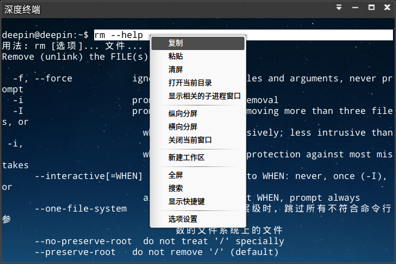
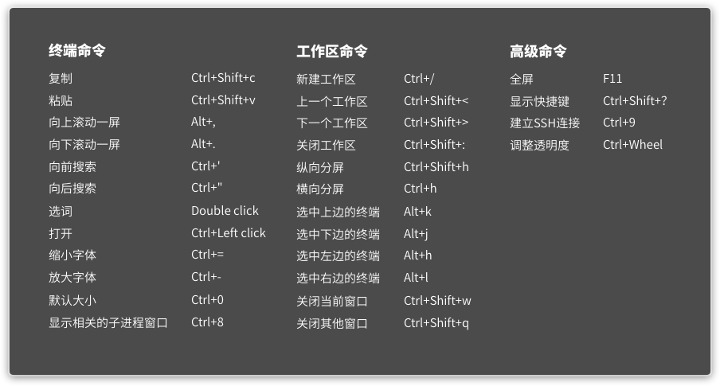
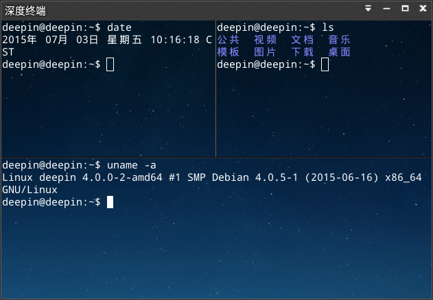
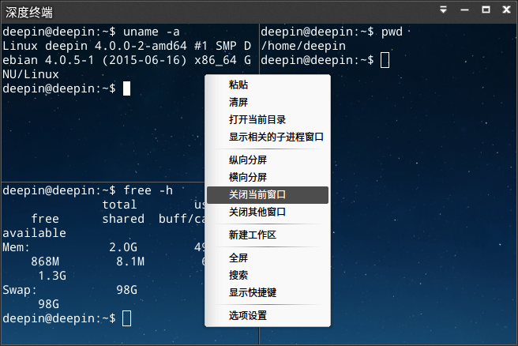
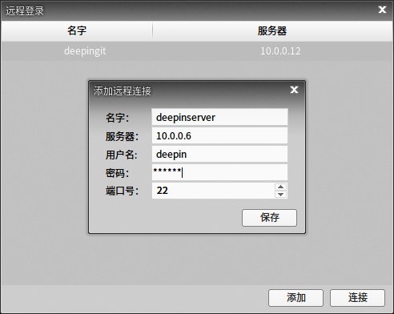
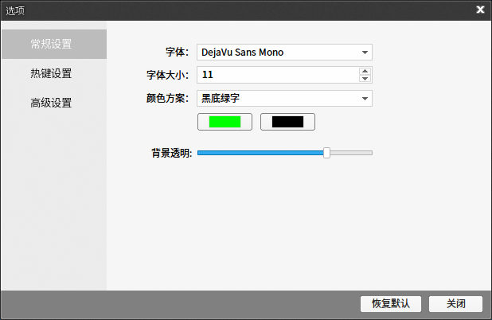
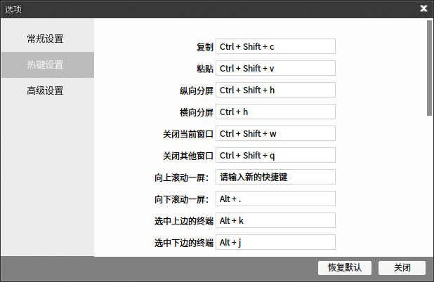
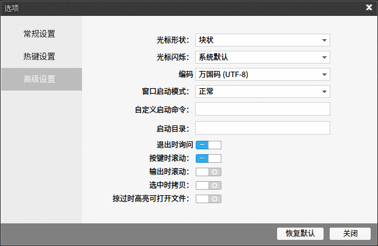

# 深度终端|../common/deepin-terminal.svg|
## 概述|../common/icon_overview.svg|
深度终端可以按照用户的要求对窗口进行任意分割，支持水平和垂直屏幕分割，允许用户改变字体、颜色和自定义背景图片、调整透明度等终端设置。您可以通过终端窗口使用键盘输入各种操作命令等。

 

## 使用入门|../common/icon_guide.svg|
### 运行深度终端 ###
您可以通过执行以下操作之一来运行深度终端：

- 点击任务栏上的  进入启动器界面，通过浏览找到  点击。
- 按下键盘上的 ++ 组合键，打开终端界面。

### 最小化深度终端 ###

1. 在启动器界面打开深度终端。
2. 在深度终端界面，点击 ，将深度终端最小化到任务栏。
3. 如果要恢复正常显示，点击任务栏上的 。

### 最大化深度终端 ###

1. 在启动器界面打开深度终端。
2. 在深度终端界面，点击 ，深度终端窗口将最大化显示。
3. 如果要恢复正常显示，请点击任务栏上的 。

### 关闭深度终端 ###
#### 点击关闭按钮退出深度终端 ####

1. 在启动器界面打开深度终端。
2. 在深度终端界面，点击 ，退出深度终端的运行。

#### 从任务栏退出深度终端 ####

1. 在启动器界面打开深度终端。
2. 右键单击任务栏上的 。
3. 点击 **关闭所有**。

#### 从主菜单退出深度终端 ####

1. 在启动器界面打开深度终端。
2. 在深度终端界面，点击 。
3. 点击 **退出**。

## 基本操作|../common/icon_basicoperation.svg|
您可以在深度终端界面点击鼠标右键来进行日常操作。

 

### 搜索 ###
您可以使用搜索功能来快速查找终端屏幕前面显示的内容。

1. 在启动器界面打开深度终端。
2. 在深度终端界面，点击鼠标右键。
3. 点击 **搜索**。
4. 在搜索框中输入要查找的字符，搜索到的结果将高亮显示。
5. 如果要退出搜索，请点击搜索框后面的 。

### 复制/粘贴 ###
您可以将屏幕内容直接从别处拷贝到终端中来执行，或将终端中的命令复制到其他地方。

1. 选中要复制的命令或内容。
2. 在深度终端界面，点击鼠标右键。
3. 点击 **粘贴**，将命令拷贝到终端执行。
4. 如果要从深度终端复制命令到其他地方，请选中要复制的命令或内容，点击鼠标右键。
5. 点击 **复制**，将命令拷贝到别处。

### 打开当前目录 ###
当您在深度终端界面操作时，可以快速定位并打开当前操作的目录。

1. 在启动器界面打开深度终端。
2. 在终端窗口中，点击鼠标右键。
3. 点击 **打开当前目录**，打开该终端窗口中所执行命令的目录。

### 显示子进程窗口 ###
您可以在深度终端中将正在运行的子进程窗口置顶显示。

1. 在启动器界面打开深度终端。
2. 在终端窗口中，点击鼠标右键。
3. 点击 **显示相关的子进程窗口**，在桌面置顶显示该子进程的窗口。

### 清屏 ###
清除终端屏幕，保持屏幕的空间，方便您的操作。

1. 在启动器界面打开深度终端。
2. 在终端窗口中，点击鼠标右键。
3. 点击 **清屏**，清除该终端窗口中显示的所有信息。

## 快捷键|../common/icon_shortcutkey.svg|
### 查看快捷键 ###

输入命令之前先了解一下快捷键的配置，让您的后续操作事半功倍。

 

#### 按键操作 ####

1. 在启动器界面打开深度终端。
2. 按下键盘上的 ++ 组合键，打开快捷键预览界面。

#### 界面操作 ####

1. 在深度终端界面，点击鼠标右键或点击右上角的 。
2. 点击 **显示快捷键**。

<table class="block2">
    <caption>终端命令</caption>
    <tbody>
        <tr>
            <td>复制</td>
            <td>Ctrl+Shift+c</td>
        </tr>
        <tr>
            <td>粘贴</td>
            <td>Ctrl+Shift+v</td>
        </tr>
        <tr>
            <td>向上滚动一屏</td>
            <td>Alt+，</td>
        </tr>
         <tr>
            <td>向下滚动一屏</td>
            <td>Alt+.</td>
        </tr>
        <tr>
            <td>向前搜索</td>
            <td>Ctrl+'</td>
        </tr>
        <tr>
            <td>向后搜索</td>
            <td>Ctrl+"</td>
        </tr>
        <tr>
            <td>选词</td>
            <td>双击鼠标</td>
        </tr>
        <tr>
            <td>打开</td>
            <td>Ctrl+ 鼠标左键</td>
        </tr>
         <tr>
            <td>缩小字体</td>
            <td>Ctrl+-</td>
        </tr>
        <tr>
            <td>放大字体</td>
            <td>Ctrl+=</td>
        </tr>
        <tr>
            <td>默认大小</td>
            <td>Ctrl+0</td>
        </tr>
        <tr>
            <td>显示相关的子进程窗口</td>
            <td>Ctrl+8</td>
        </tr>
    </tbody>
 </table>
 
 <table class="block2">
    <caption>工作区命令</caption>
    <tbody>
        <tr>
            <td>新建工作区</td>
            <td>Ctrl+/</td>
        </tr>
        <tr>
            <td>上一个工作区</td>
            <td>Ctrl+Shift+<</td>
        </tr>
        <tr>
            <td>下一个工作区</td>
            <td>Ctrl+Shift+></td>
        </tr>
         <tr>
            <td>关闭工作区</td>
            <td>Ctrl+Shift+:</td>
        </tr>
        <tr>
            <td>纵向分屏</td>
            <td>Ctrl+Shift+h</td>
        </tr>
        <tr>
            <td>横向分屏</td>
            <td>Ctrl+h</td>
        </tr>
        <tr>
            <td>选中上边的终端</td>
            <td>Alt+k</td>
        </tr>
        <tr>
            <td>选中下边的终端</td>
            <td>Alt+j</td>
        </tr>
         <tr>
            <td>选中左边的终端</td>
            <td>Alt+h</td>
        </tr>
        <tr>
            <td>选中右边的终端</td>
            <td>Alt+l</td>
        </tr>
        <tr>
            <td>关闭当前窗口</td>
            <td>Ctrl+Shift+w</td>
        </tr>
        <tr>
            <td>关闭其他窗口</td>
            <td>Ctrl+Shift+q</td>
        </tr>
    </tbody>
 </table>
 
  <table class="block1">
    <caption>高级命令</caption>
    <tbody>
        <tr>
            <td>全屏</td>
            <td>F11</td>
        </tr>
        <tr>
            <td>显示快捷键</td>
            <td>Ctrl+Shift+？</td>
        </tr>
        <tr>
            <td>建立 SSH 连接</td>
            <td>Ctrl+9</td>
        </tr>
         <tr>
            <td>调整透明度</td>
            <td>Ctrl+ Wheel</td>
        </tr>
 </table>
 
#### 退出快捷键预览界面 #### 

如果要退出快捷键预览界面，您可以执行以下操作之一：

- 按下键盘上的  键退出。
- 在快捷键预览界面的任意位置，点击鼠标退出。
 
### 设置快捷键 ###

1. 在深度终端界面，点击鼠标右键或点击右上角的 。
2. 点击 **选项设置**。
3. 选择 **热键设置** 页签，点击需要修改的快捷键进行更改。

>  ：如果您需要更改快捷键，具体操作请参阅 [热键设置](#热键设置)。

## 窗口操作|../common/icon_windowoperation.svg|

### 新建终端窗口 ###

 

#### 新建窗口 ####

1. 在启动器界面打开深度终端。
2. 右键单击任务栏上的 。
3. 点击 **新建窗口**，将会在桌面打开一个新的终端。

#### 新建雷神窗口 ####

1. 在启动器界面打开深度终端。
2. 右键单击任务栏上的 。
3. 点击 **新建雷神窗口**，将会在桌面打开一个雷神模式的终端窗口。

>  ：您也可以按下键盘上的  键打开雷神模式的终端窗口。

### 分割终端窗口 ###

1. 在启动器界面打开深度终端。
2. 在深度终端界面，点击鼠标右键。
 - 点击 **纵向分屏**，界面被分为上下两个部分。
 - 点击 **横向分屏**，界面被分为左右两个部分。
3. 您可以在各个终端窗口中输入命令，并可以同时查看到命令执行的结果。

>  ：您也可以按下键盘上的 ++ 组合键来纵向分屏，按下键盘上的 + 组合键来横向分屏。

 

### 全屏显示终端窗口 ###

1. 在启动器界面打开深度终端。
2. 按下键盘上的  键，深度终端将全屏显示。
3. 如果要恢复正常大小显示，请按下键盘上的  键。

>   ：您也可以在深度终端界面，点击鼠标右键，选择 **全屏** 或 **退出全屏**。

### 关闭终端窗口 ###
对于分割的多个终端窗口，您可以执行以下操作来关闭：

1. 在深度终端界面，将鼠标指针置于其中一个终端窗口中。
2. 点击右键，您可以：
 - 选择 **关闭当前窗口**，来关闭此终端窗口。
 - 选择 **关闭其他窗口**，来关闭除此窗口以外的其他终端窗口。

 

## 工作区操作|../common/icon_workspaceoperation.svg|
### 新建工作区 ###

1. 在启动器界面打开深度终端。
2. 在深度终端界面，点击鼠标右键。
3. 点击 **新建工作区**，将会在该终端中新建一个工作区。

### 切换工作区 ###
您可以在多个工作区之间任意切换，具体操作如下：

1. 在启动器界面打开深度终端。
2. 在深度终端界面，点击鼠标右键。
3. 点击 **切换工作区**，所有的工作区会以预览窗口的形式横向排列在界面下方，您可以：
 - 将鼠标指针置于工作区预览窗口上，点击鼠标来切换到该工作区。
 - 将鼠标指针置于工作区预览窗口上，点击  来关闭该工作区。
 - 点击  来创建一个新的工作区。

 

> ：您也可以在深度终端界面，通过点击左下角的数字序号来切换工作区。

### 关闭工作区 ###

1. 在启动器界面打开深度终端。
2. 在深度终端界面，将鼠标指针置于其中一个工作区中。
3. 点击右键，选择 **关闭工作区**。

## SSH连接|../common/icon_sshconnection.svg|
您可以在终端窗口中直接输入 SSH 连接命令来连接到指定的服务器地址。您也可以
通过执行以下操作来建立 SSH 远程连接。

1. 在启动器界面打开深度终端。
2. 在深度终端界面，点击右上角的 。
3. 点击 **建立 SSH 连接**，弹出远程登录框。
4. 点击 **添加**，输入服务器地址、用户名和密码来创建一个远程连接。
5. 点击 **保存**，选择要连接的服务器，点击 **连接**。

 

## 选项设置|../common/icon_settings.svg|
### 常规设置 ###

1. 在启动器界面打开深度终端。
2. 在深度终端界面，点击鼠标右键或点击右上角的  。
3. 点击 **选项设置**。
4. 在 **常规设置** 页签下，您可以：
 - 设置深度终端的字体及其大小。
 - 设置深度终端的配色方案。
 - 设置深度终端的背景透明度。

 

### 热键设置 ###

1. 在启动器界面打开深度终端。
2. 在深度终端界面，点击鼠标右键或点击右上角的 。
3. 点击 **选项设置**。
4. 在 **热键设置** 页签下，您可以：
 - 点击要修改的功能快捷键，使用键盘输入新的快捷键。
 - 如果要禁用该快捷键，请按下键盘上的  键。
 - 如果要恢复默认设置，请点击 **恢复默认**。

 

### 高级设置 ###

1. 在启动器界面打开深度终端。
2. 在深度终端界面，点击鼠标右键或点击右上角的 。
3. 点击 **选项设置**。
4. 在 **高级设置** 页签下，您可以：
 - 设置光标形状。
 - 开启或关闭光标闪烁。
 - 选择编码方式。
 - 设置窗口启动模式。
 - 自定义启动命令。
 - 指定启动目录。
 - 开启或关闭 **退出时询问** 功能。
 - 开启或关闭 **按键时滚动** 功能。
 - 开启或关闭 **输出时滚动** 功能。
 - 开启或关闭 **选中时拷贝** 功能。
 - 开启或关闭 **掠过时高亮可打开文件** 功能。

 
