# Deepin Terminal|../common/deepin-terminal.svg|

## Overview|../common/icon_overview.svg|

Deepin Terminal is a terminal emulator with simple interface, rich and powerful functions created by Deepin Technology. You can instantly start and close Deepin Terminal smoothly like normal file window, allowing you to input commands with facility and no distractions. Let's try the Quake mode, browse webs while inputting commands. When there are multiple tasks, you can add tabs in terminal to create more workspaces like in the browser or split the workspace into multiple windows. It's a piece of cake to upload and download files with remote management. More powerful functions are waiting for you to explore!

 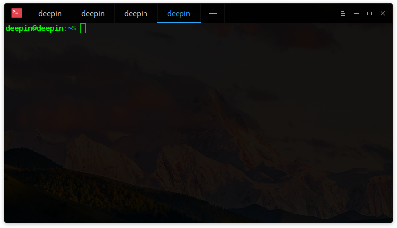

## Guide|../common/icon_guide.svg|

You can run, exit or create shortcuts for Deepin Terminal.

### Run Deepin Terminal ###

1. Click on  on dock to enter launcher interface.
2. Find  to click on, you can:
 - Click on **Send to desktop** to create a desktop shortcut.
 - Click on **Send to dock** to fix it on dock.
 - Click on **Add to startup** to add it to startup, it will automatically run when the system starts up.

> : You can also press ++ to open Deepin Terminal.

### Exit Deepin Terminal ###

1. On Deepin Terminal interface, click on  to exit.

2. Right click on  on Dock and select **Close All** to exit.

3. On Deepin Terminal interface, click on  to select **Exit** to exit.

> : There will be a prompt when programs are still running in terminal.

### View Shortcuts ###

You can press ++ on keyboard to open shortcuts preview interface.

 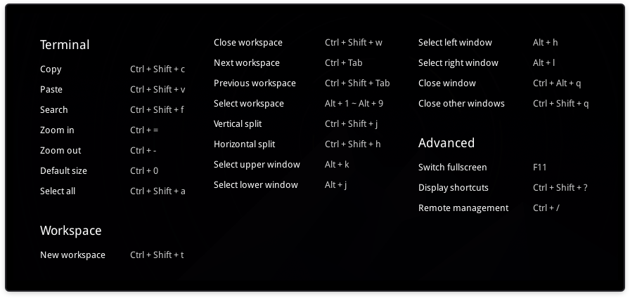

## Basic Operations|../common/icon_basicoperation.svg|

You can right click on Deepin Terminal interface to do daily operations.

 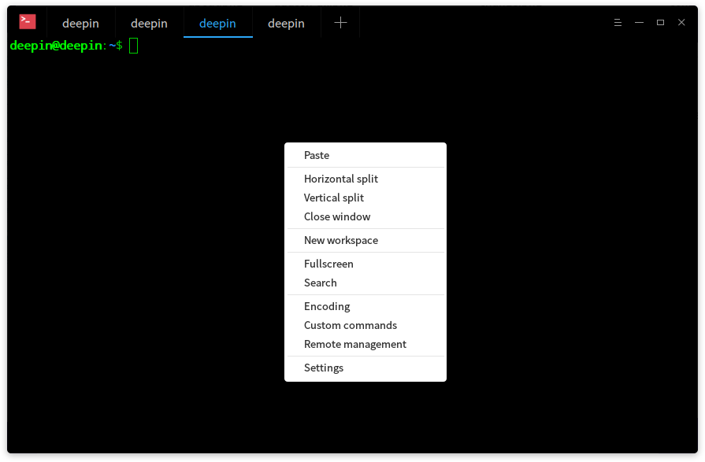

### Search ###

You can use the search function to quickly search contents in terminal.

1. Right click on Deepin Terminal interface.

2. Click on **Search**.

3. Type the word in search box and click on .

4. Then the search results will be highlighted.

5. Press  on keyboard or click on any location of terminal interface to exit search.

> : Press  to search down from current location. You can also click on  and  to search.

### Google ###

You can search the keyword through Google in terminal.

1. Type some words in terminal.

2. Selected the words and right click to select **Google**.

3. The words will be searched and the results will be displayed in Google.

### Copy/Paste ###

You can freely copy and paste the contents or commands among terminal and anywhere else.

1. Select the commands or contents to be copied.

2. Right click to select **Copy** to copy elsewhere.

3. If you want to paste on terminal, right click to select **Paste**.

> : If the content is a link, you can also right click to copy by hovering on it even no contents selected.

### Quake Mode ###

Press  +  to open a quake window, and then hide after lost focus.

> : You can also click on  on Dock to select **Quake Terminal** to open a quake window.

### Open File and Application Program ###

On Deepin Terminal interface, select the file in current directory and right-click to select **Open** to call the system application to open the selected file.

1. On Deepin Terminal interface, input **ls -al** to display files in current directory.

2. Double-click the left mouse button to select the file name.

3. Right-click.

4. Click on **Open**.

 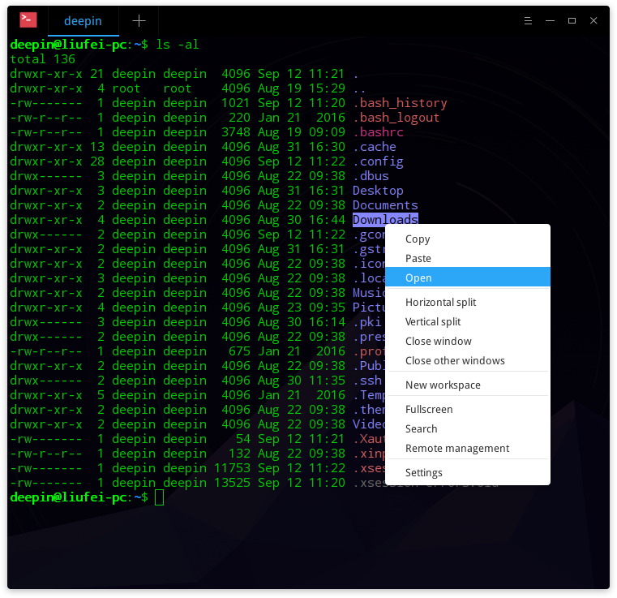

### Switch Encoding ###

You can quickly switch the encoding according to your needs.

1. Right click on Deepin Terminal interface.

2. Select **Encoding**.

3. Select the encoding to switch in the encoding list.

 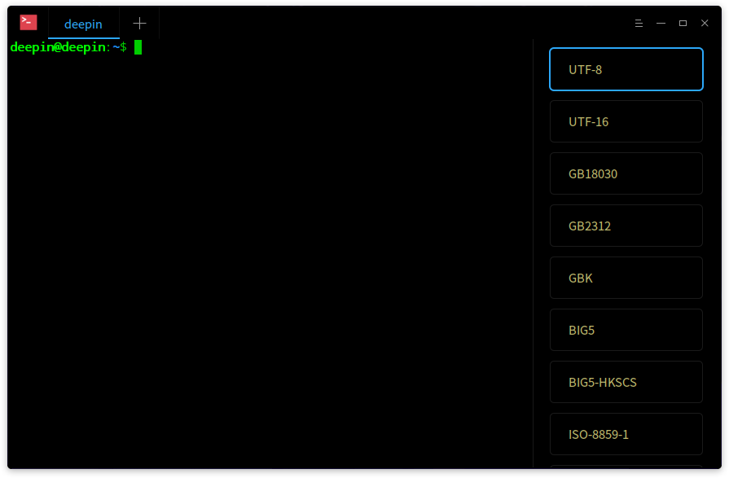

## Window Operations|../common/icon_windowoperation.svg|

Window is the base for you to do other operations in terminal. You can create many workspaces and split more windows.

### New Window ###

You can create a new window in the following ways:

1. Open Deepin Terminal and click on  to select **New Window**.

2. Click on  on Dock to select **New Window**.

3. Press ++ 1~9 Number key to open new windows in different colors.

 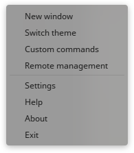

### Rename Window ###

1. Right click on Deepin Terminal interface.

2. Select **Rename title**.

3. Input the name and click on **Rename**.

> : You can also press   to rename the window title.

 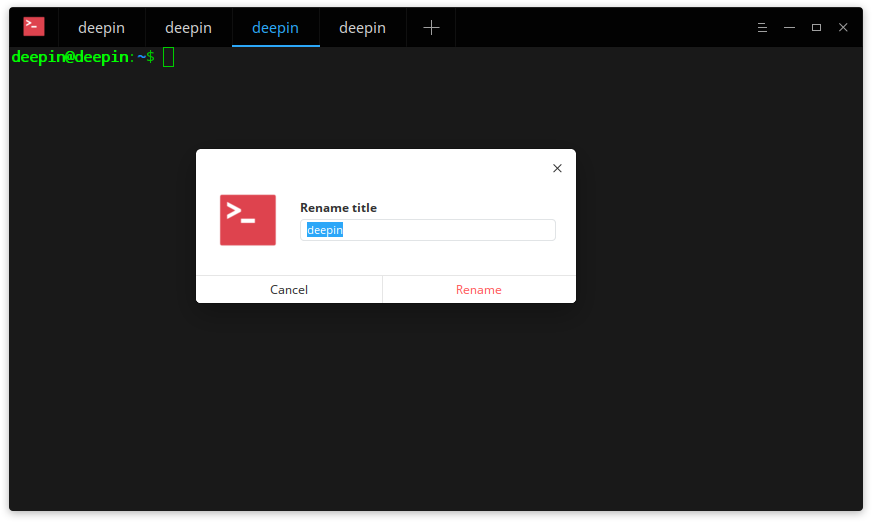

### Split Window ###

1. Right click on Deepin Terminal interface.

  - Click on **Vertical split** to split the interface into left and right parts.

  - Click on **Horizontal split** to split the interface into top and bottom parts.

2. You can input commands in each terminal window, and can also view the results of command executed.

> : You can also press ++ on keyboard to split vertically, and press ++ to split horizontally.

 

### Display Window in Fullscreen ###

1. Open Deepin Terminal in launcher interface.

2. Press  to display Deepin Terminal in fullscreen.

3. If you want to restore the normal display, please press .

> : You can also right click to select **Fullscreen** or **Exit fullscreen** on Deepin Terminal interface.
For developers, can use command **-m --window-mode ** to adjust the window mode.

### Close Window ###

For multiple splitting windows, you can execute the following operations to close:

1. On Deepin terminal interface, move the mouse pointer over one of the splitting windows.

2. Right click, you can:

  - Select **Close window** to close this splitting window.

  - Select **Close other windows** to close other splitting windows except the current window.

 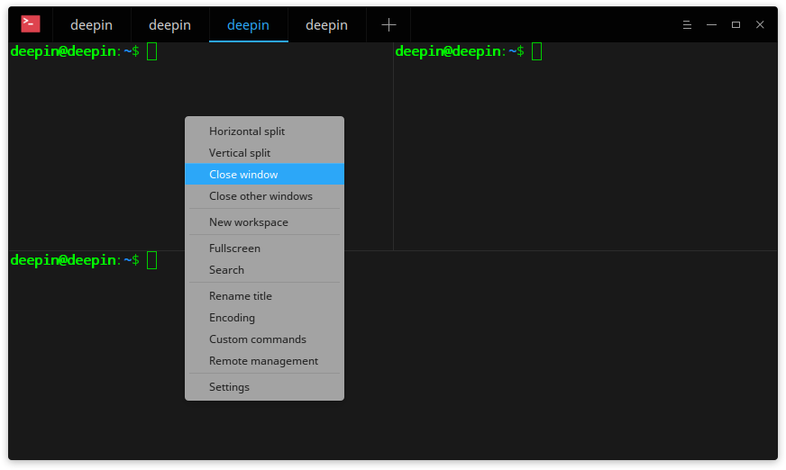

## Workspace Operations|../common/icon_workspaceoperation.svg|

The current workspace status will be displayed in different colors of workspace tabs.

 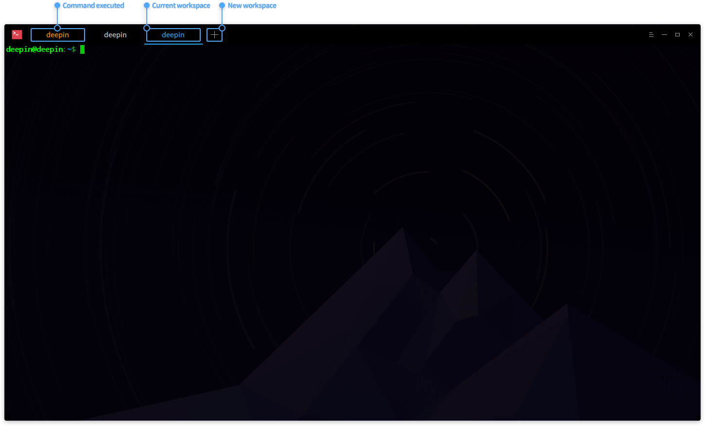

### New Workspace ###

- Right click on Deepin Terminal interface and select **New workspace** to create a new workspace.

- Click on  on the top to create a workspace.

### Select Workspace ###

You can freely switch between multiple workspaces by one of the following operations:

- Directly click the workspace tab to select a workspace.
- Press + to switch in sequence.
- Press + 1~9 Number key to select the workspace; when workspaces are more than 9, the last workspace will be selected rather the ninth one.

### Close Workspace ###

- Move the mouse pointer over the preview window of workspace, click on  to close the workspace.

- Press ++

> : When there is only one window in workspace, you can also right click to select **Close window** to close.

## Remote Server Management|../common/icon_sshconnection.svg|

You can right click or click the main menu to open remote management panel to add remote servers. The remote management panel will be automatically hidden when you adjust the window size.

### Add Server ###

1. On Deepin Terminal interface, right click or click on  in the top right corner.

2. Select **Remote management** to open the panel.

3. Click on **Add server** to fill out:

  - Server name
  - Address
  - Username
  - Password
  - Certificate

4. Click on **Add** to add.

5. If you need more parameters, please click on **Advanced options** to set, the default certificate file located in ~/.ssh/id_rsa.

 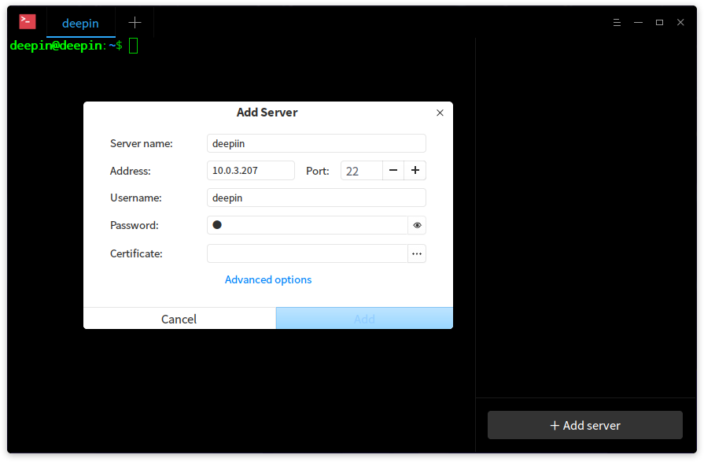

> : You can also press + to open the remote management panel.

### Edit Server ###

1. Hover the mouse pointer over the server added, click on  to enter the detailed interface.

2. Edit as needed.

3. Click on **Save** to save the editing.

 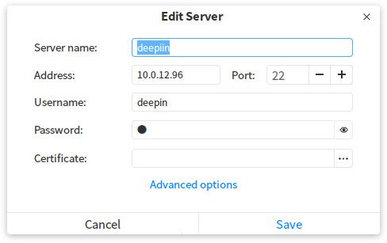

### Group Servers ###

When we set a group for a server, it will be added in the group and displayed in the right remote management panel.

1. Enter "Edit Server" interface.

2. Click on **Advanced options**.

3. Fill out the group and click on **Save**.

4. Then this server will be grouped.

 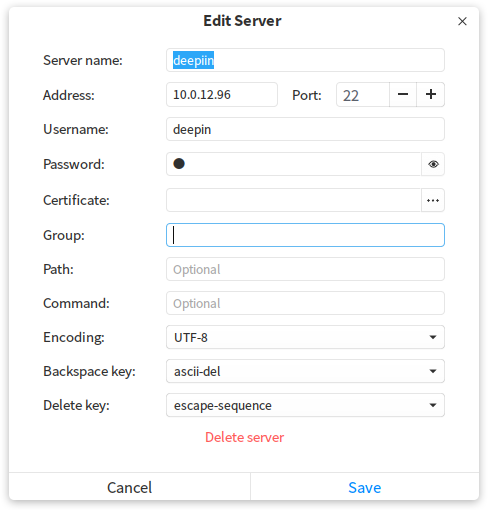

### Search Server ###

When there are many servers, the search box will be displayed on the top of remote management panel.

1. Input the server name and press .

2. The search results will be displayed at the panel.

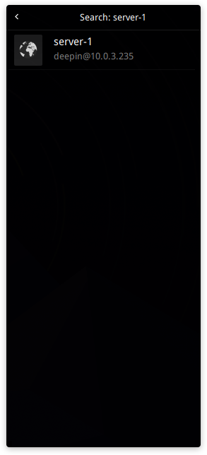

> : You can customize the searched server name according to needs.

### Upload/Download File ###

You can upload and download files after logged in a server.

#### Upload File ####

1. On the remote management panel, click one of the servers to log in.

2. Right click to select **Upload file**.

3. Select file to upload.

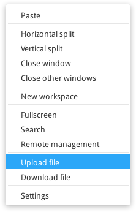

#### Download File ####

1. On the remote management panel, click one of the servers to log in.

2. Right click to select **Download file**.

3. Select file to download.

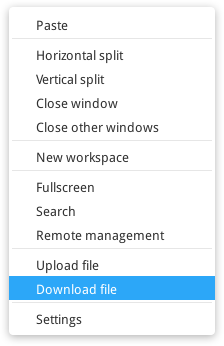

### Delete Server ###

1. Enter "Edit Server" interface.

2. Click on **Advanced options**.

3. Select **Delete server** at the bottom to delete.

## Main Menu|../common/icon_settings.svg|

### Switch Theme ###

1. On Deepin Terminal interface, click on  in the top right corner.

2. Click on **Switch theme**.

3. The themes will be displayed on the right list, then you can select one to take effect right now.

 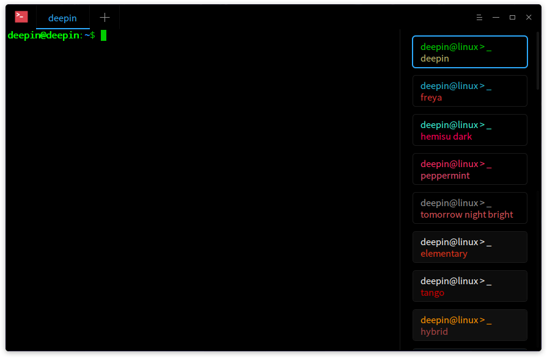

### Custom Commands ###

1. On Deepin Terminal interface, click on  in the top right corner.

2. Click on **Custom commands**.

3. Select **Add command**.

4. Input **Name**, **Command** and **Shortcuts**.

5. Click on **Add**.

 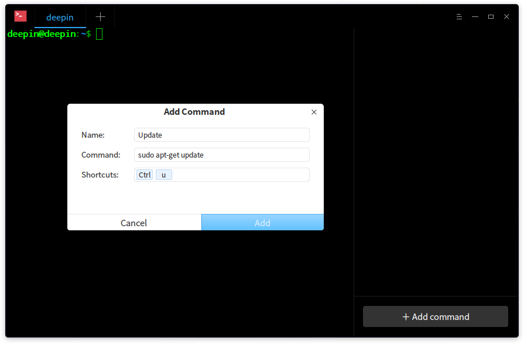

> : You can also right click on the Deepin Terminal interface and select **Custom commands** to add.

### Basic Settings ###

1. On Deepin Terminal interface, click on  in the top right corner.

2. Click on **Settings**.

3. In the interface of **Basic**, you can:

  - Set the background transparency.

  - Set the font and font size.

 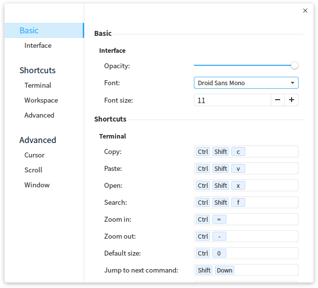

### Shortcuts Settings ###

1. On Deepin Terminal interface, click on  in the top right corner.

2. Click on **Settings**.

3. In the interface of **Shortcuts**, you can:

  - Click the shortcuts to be modified, and input new shortcuts by keyboard.

  - Press  if you want to disable the shortcut.

 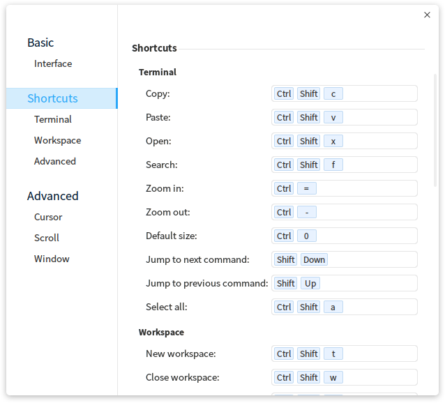

### Advanced Settings ###

1. On Deepin Terminal interface, click on  in the top right corner.

2. Click on **Settings**.

3. In the interface of **Advanced**, you can:

  - Set cursor style.

  - Enable or disable **Cursor blink**.

  - Enable or disable **Cursor autohide**.

  - Enable or disable **Scroll on keystroke**.

  - Enable or disable **Scroll on output**.

  - Set window startup mode.

  - Enable or disable **Hide quake window after lost focus**.

 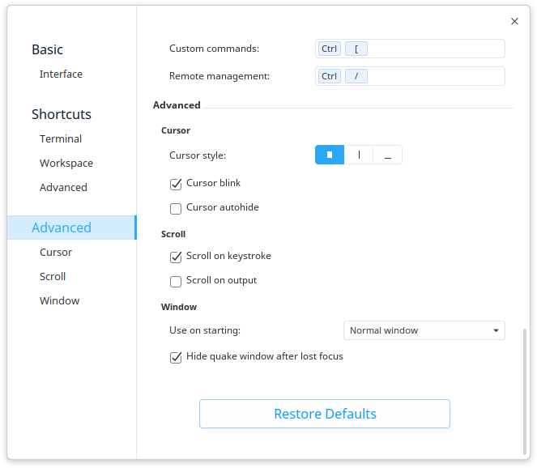

> : If you need to restore all default settings, please click on **Restore Defaults**.

### Help ###

You can click on **Help** to view the manual.

1. On Deepin Terminal interface, click on  in the top right corner.

2. Click on **Help** to view the manual of Deepin Terminal.

 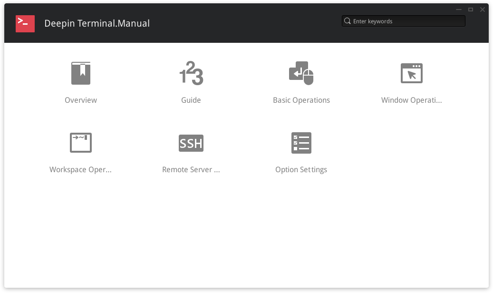

### About ###

You can click on **About** to view the introduction of Deepin Terminal.

1. On Deepin Terminal interface, click on  in the top right corner.

2. Click on **About** to view the introduction of Deepin Terminal.

 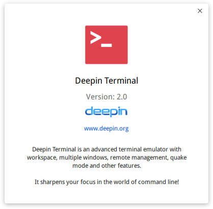

### Exit ###

You can click on **Exit** to exit Deepin Terminal.

1. On Deepin Terminal interface, click on  in the top right corner.

2. Click on **Exit** to exit.
